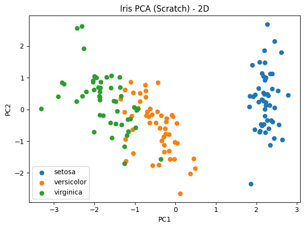
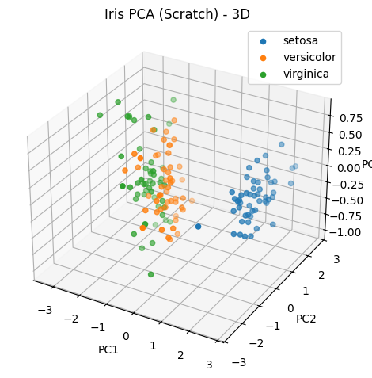

# PCA From Scratch vs scikit-learn

## Overview
This project reimplements **Principal Component Analysis (PCA)** from scratch using NumPy,  
and compares the results against scikit-learn’s PCA implementation.  
It demonstrates both **covariance eigen-decomposition** and **SVD** approaches,  
and visualizes the data in lower dimensions (2D and 3D).

## Key Features
- Standardizes data to zero mean and unit variance  
- PCA from scratch via covariance eigen-decomposition  
- PCA from scratch via SVD (singular value decomposition)  
- Comparison with scikit-learn PCA (explained variance ratios and component alignment)  
- Visualization:
  - 2D scatter plots  
  - 3D scatter plots  

## Example Output

=== PCA Comparison (ours vs. scikit-learn on standardized data) ===

Explained variance ratio (ours):        [0.729624 0.228508]

Explained variance ratio (sklearn):    [0.729624 0.228508]

Absolute difference:                   [0. 0.]

Component alignment (abs dot products):

[[1. 0.]

 [0. 1.]]

### Example Plots




## Skills Demonstrated
- Numerical linear algebra (eigendecomposition, SVD)  
- Data preprocessing and standardization  
- ML validation and comparison against libraries  
- Python (NumPy, scikit-learn, Matplotlib)  

## How to Run
```bash
pip install -r requirements.txt
python pca_from_scratch_vs_sklearn.py --dataset iris
python pca_from_scratch_vs_sklearn.py --dataset wine
